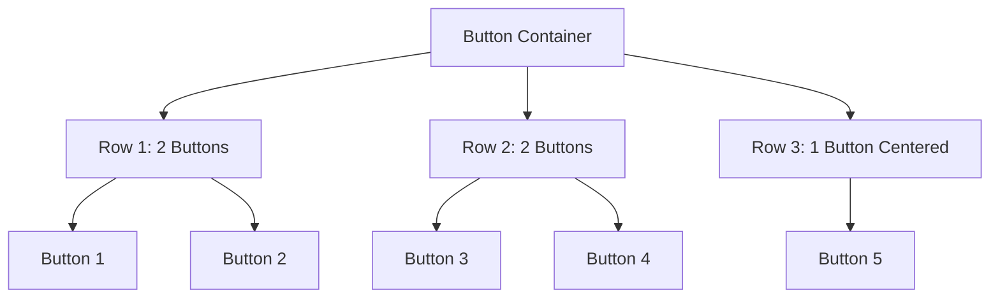

# Design Document

## Overview

This design document outlines the approach for standardizing button appearance and layout in the Physical Receipt System. The solution focuses on creating a consistent grid-based layout with uniform button sizing and spacing that works well on mobile devices.

## Architecture

### Button Standardization Approach

The standardization will be achieved through:
1. **CSS-based sizing**: Using consistent width and height values
2. **Grid layout**: Implementing a responsive grid system for button arrangement
3. **Spacing standardization**: Using consistent margins and padding
4. **Mobile-first design**: Ensuring touch-friendly button sizes

### Layout Strategy



## Components and Interfaces

### Button Specifications

#### Standard Button Dimensions
- **Width**: 180px (fixed width for consistency)
- **Height**: 48px (touch-friendly height)
- **Margin**: 8px between buttons
- **Padding**: Standard UI5 button padding

#### Grid Layout Configuration
- **Container**: VBox with centered alignment
- **Rows**: HBox containers with space-between justification
- **Responsive**: Buttons wrap appropriately on smaller screens

### Implementation Approach

#### XML Structure
```xml
<VBox class="buttonContainer" alignItems="Center">
    <HBox class="buttonRow" justifyContent="SpaceEvenly">
        <Button width="180px" class="standardButton" />
        <Button width="180px" class="standardButton" />
    </HBox>
    <HBox class="buttonRow" justifyContent="SpaceEvenly">
        <Button width="180px" class="standardButton" />
        <Button width="180px" class="standardButton" />
    </HBox>
    <HBox class="buttonRow" justifyContent="Center">
        <Button width="180px" class="standardButton" />
    </HBox>
</VBox>
```

#### CSS Styling
```css
.buttonContainer {
    padding: 16px;
}

.buttonRow {
    margin-bottom: 12px;
    width: 100%;
}

.standardButton {
    margin: 4px 8px;
}
```

## Error Handling

### Layout Responsiveness
- Buttons maintain minimum touch target size (44px)
- Text truncation for long button labels
- Graceful degradation on very small screens

## Testing Strategy

### Visual Testing
- Cross-device button appearance verification
- Layout consistency across different screen sizes
- Touch interaction testing on mobile devices