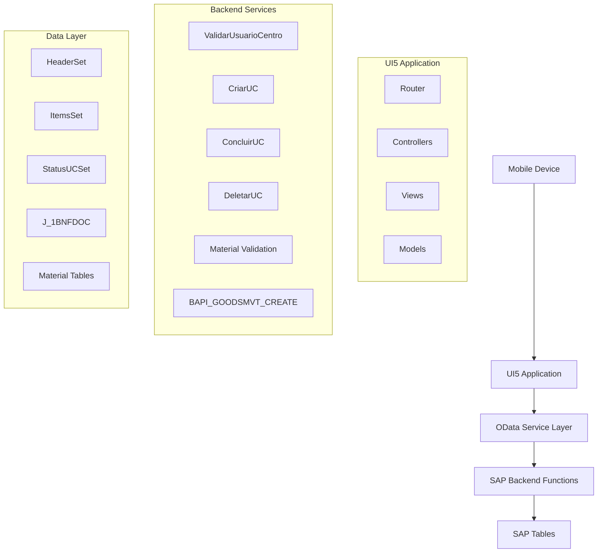
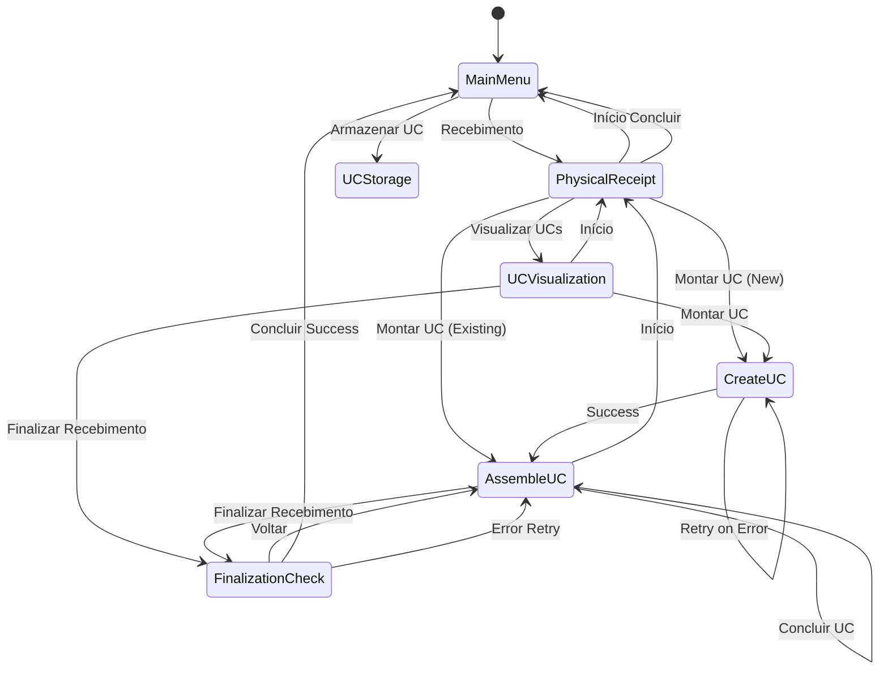

# Design Document

## Overview

The Physical Receipt System is a mobile-first SAP Fiori application built using UI5 framework that manages warehouse receipt operations. The system follows a multi-screen workflow that guides operators through invoice validation, UC creation, material scanning, and goods transfer processes.

The application integrates with SAP EWM backend services through OData v2 and provides real-time validation and processing capabilities for warehouse operations.

## Architecture

### High-Level Architecture



### Application Flow



## Components and Interfaces

### View Components

#### 1. MainMenu (View1)
- **Purpose**: Entry point with main navigation options
- **Components**: 
  - Title: "Recebimento ELGIN"
  - Button: "Recebimento" 
  - Button: "Armazenar UC"
  - Button: "Voltar"
- **Controller**: MainMenuController
- **Navigation**: Routes to PhysicalReceipt or UCStorage views

#### 2. PhysicalReceipt (View2)
- **Purpose**: Invoice and container data entry with action selection
- **Components**:
  - Input: "NF" (Invoice Number)
  - Input: "Identificador" (Container/Truck ID)
  - Button: "Ocorrência"
  - Button: "Visualizar UCs"
  - Button: "Início"
  - Button: "Concluir"
  - Button: "Montar UC"
- **Controller**: PhysicalReceiptController
- **Validation**: Invoice existence, receipt status checking

#### 3. CreateUC (View3)
- **Purpose**: Packaging material specification for UC creation
- **Components**:
  - Display: "Nota fiscal" (read-only)
  - Display: "Identificador" (read-only)
  - Input: "Mat. Embalagem" (Packaging Material)
  - Button: "Início"
  - Button: "Montar UC"
- **Controller**: CreateUCController
- **Integration**: Material validation and UC creation functions

#### 4. AssembleUC (View4)
- **Purpose**: Material scanning and UC assembly
- **Components**:
  - Display: "Nota fiscal", "Identificador", "UC" (read-only)
  - Input: "Material" (Barcode scanner)
  - Input: "Quantidade material"
  - Conditional: "Validade" (Month/Year selectors)
  - Button: "Ocorrência"
  - Button: "Início"
  - Button: "Concluir UC"
  - Button: "Finalizar Recebimento"
- **Controller**: AssembleUCController
- **Features**: Barcode validation, expiration date handling

#### 5. UCVisualization
- **Purpose**: Display and manage existing UCs
- **Components**:
  - Display: "Nota fiscal", "Identificador" (read-only)
  - List: UC numbers with delete buttons
  - Button: "Início"
  - Button: "Montar UC"
  - Button: "Finalizar Recebimento"
- **Controller**: UCVisualizationController
- **Features**: UC listing, deletion functionality

#### 6. FinalizationCheck
- **Purpose**: Review and finalize receipt with goods transfer
- **Components**:
  - Display: "Nota fiscal", "Identificador"
  - Display: "Leituras realizadas" (scanned items list)
  - Button: "Voltar"
  - Button: "Concluir"
- **Controller**: FinalizationController
- **Integration**: Goods movement BAPI execution

### Controller Architecture

#### Base Controller Pattern
```javascript
sap.ui.define([
    "sap/ui/core/mvc/Controller",
    "sap/m/MessageToast",
    "sap/m/MessageBox"
], function (Controller, MessageToast, MessageBox) {
    "use strict";
    
    return Controller.extend("zui5recebfisic.controller.BaseController", {
        // Common navigation methods
        // Error handling utilities
        // Message display functions
        // Model access helpers
    });
});
```

#### Specialized Controllers
- **MainMenuController**: Navigation logic
- **PhysicalReceiptController**: Invoice validation, receipt status checking
- **CreateUCController**: Material validation, UC creation
- **AssembleUCController**: Barcode processing, item management
- **UCVisualizationController**: UC listing, deletion
- **FinalizationController**: Goods transfer execution

### Service Integration Layer

#### OData Model Configuration
```javascript
// manifest.json model configuration
"models": {
    "": {
        "dataSource": "mainService",
        "preload": true,
        "settings": {
            "defaultBindingMode": "TwoWay",
            "defaultCountMode": "Inline"
        }
    }
}
```

#### Function Import Calls
```javascript
// Example service call pattern
_callFunctionImport: function(functionName, parameters) {
    return new Promise((resolve, reject) => {
        this.getModel().callFunction("/" + functionName, {
            urlParameters: parameters,
            success: resolve,
            error: reject
        });
    });
}
```

## Data Models

### Local Data Models

#### Receipt Context Model
```javascript
{
    nf: "",                    // Invoice number
    identificador: "",         // Container/Truck ID
    uc: "",                   // Current UC number
    operacao: "",             // Operation type (Normal/Importação)
    statusReceb: "",          // Receipt status
    statusContainer: "",      // Container status
    items: []                 // Scanned items array
}
```

#### Scanned Item Model
```javascript
{
    material: "",             // SAP material number
    material13: "",           // 13-digit barcode
    material14: "",           // 14-digit barcode
    quantidade: "",           // Quantity
    dataValidade: "",         // Expiration date
    itemUc: ""               // Sequential item number
}
```

### Backend Entity Models

#### Header Entity
- **Key**: Nf + Identificador
- **Fields**: Operacao, StatusReceb, StatusContainer
- **Navigation**: ItemsSet (1:N relationship)

#### Items Entity
- **Key**: Nf + Uc + ItemUc + Identificador
- **Fields**: DataValidade, Material13, Material14, Material, Quantidade, StatusUc

#### StatusUC Entity
- **Key**: Nf + Identificador + Uc
- **Fields**: Status
- **Navigation**: ItemsSet (1:N relationship)

## Error Handling

### Validation Error Patterns

#### Client-Side Validation
```javascript
_validateInputs: function() {
    const nf = this.byId("nfInput").getValue();
    const identificador = this.byId("identificadorInput").getValue();
    
    if (!nf || !identificador) {
        MessageBox.error("Preencha todos os campos obrigatórios");
        return false;
    }
    return true;
}
```

#### Server-Side Error Handling
```javascript
_handleServiceError: function(error) {
    let message = "Erro no processamento";
    
    if (error.responseText) {
        try {
            const errorData = JSON.parse(error.responseText);
            message = errorData.error.message.value;
        } catch (e) {
            // Use default message
        }
    }
    
    MessageBox.error(message);
}
```

### Error Recovery Strategies

1. **Network Errors**: Retry mechanism with exponential backoff
2. **Validation Errors**: Clear field highlighting and specific messages
3. **Business Logic Errors**: Context-aware error messages with suggested actions
4. **System Errors**: Graceful degradation with manual retry options

## Testing Strategy

### Unit Testing Approach

#### Controller Testing
```javascript
QUnit.module("PhysicalReceiptController", {
    beforeEach: function() {
        this.oController = new PhysicalReceiptController();
        this.oModel = new JSONModel();
        this.oController.getView = () => ({
            getModel: () => this.oModel
        });
    }
});

QUnit.test("Should validate invoice format", function(assert) {
    // Test invoice validation logic
});
```

#### Service Integration Testing
- Mock OData service responses
- Test error scenarios
- Validate data transformation

### Integration Testing

#### End-to-End Scenarios
1. **Complete Receipt Flow**: From main menu to finalization
2. **Error Recovery**: Test all error conditions and recovery paths
3. **Data Persistence**: Verify backend data consistency
4. **Navigation**: Test all navigation paths and state management

#### Mobile Device Testing
- Touch interface responsiveness
- Barcode scanner integration
- Offline capability (if required)
- Performance on various device sizes

### Performance Testing

#### Key Metrics
- Screen load times < 2 seconds
- Service call response times < 5 seconds
- Memory usage optimization for mobile devices
- Battery consumption monitoring

#### Load Testing Scenarios
- Multiple concurrent users
- Large dataset handling
- Network latency simulation
- Backend service stress testing

## Security Considerations

### Authentication and Authorization
- SAP user authentication integration
- Role-based access control
- Session management
- Secure token handling

### Data Protection
- Input sanitization
- SQL injection prevention
- Cross-site scripting (XSS) protection
- Sensitive data encryption in transit

### Mobile Security
- Device authentication
- Secure storage of temporary data
- Network communication encryption
- Application sandboxing

## Deployment and Configuration

### Environment Configuration
- Development: Mock data and local testing
- Quality: Integration testing with SAP backend
- Production: Full SAP system integration

### Configuration Parameters
- Backend service URLs
- Timeout settings
- Retry mechanisms
- User interface themes
- Barcode scanner settings

### Monitoring and Logging
- Application performance monitoring
- Error logging and alerting
- User activity tracking
- System health dashboards